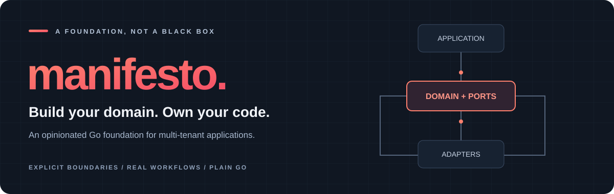
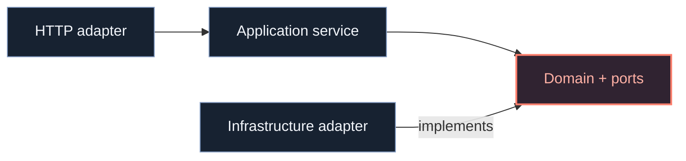

<div align="center">



# Manifesto

**The structure you need. The code you own.**

A Go reference implementation for multi-tenant backends.<br />
Explicit architecture, tenant-scoped IAM, and infrastructure you can adapt.

<p>
  <a href="go.mod"></a>
  <a href="docs/architecture.md"></a>
  <a href="docs/iam.md"></a>
  <a href="docs/operations.md"></a>
</p>

**[Explore the docs](docs/README.md)** &nbsp; · &nbsp;
**[Understand the architecture](docs/architecture.md)** &nbsp; · &nbsp;
**[Get started](#get-started)** &nbsp; · &nbsp;
**[Manifesto CLI ↗](https://github.com/Abraxas-365/manifesto-cli)**

</div>

---

## A foundation, not a black box

Manifesto brings a consistent structure to the parts of a backend that every team needs: identity, permissions, persistence, configuration, and integrations. It is both a **project skeleton** and a **reference for the decisions behind it**.

Start from the implementation. Adapt it to your domain. Keep ownership of the result.

No framework runtime to work around. No dependency-injection magic to trace. Just Go packages, explicit contracts, and visible composition.

<table>
<tr>
<td width="50%" valign="top">
<h3>01 · Own the implementation</h3>
<p>Application-owned source, not an opaque dependency. Change the internals when your domain needs something different.</p>
</td>
<td width="50%" valign="top">
<h3>02 · Make boundaries visible</h3>
<p>Ports and adapters, typed IDs, and plain constructors. See what a module needs and where its responsibilities end.</p>
</td>
</tr>
<tr>
<td width="50%" valign="top">
<h3>03 · Model real workflows</h3>
<p>Invitations, onboarding, suspension, and revocation are explicit operations—not incidental side effects of generic CRUD.</p>
</td>
<td width="50%" valign="top">
<h3>04 · Keep tenant authority local</h3>
<p>Actors identify who made a request. Scopes authorize actions. Tenant constraints define which resources are accessible.</p>
</td>
</tr>
</table>

## One foundation. Useful building blocks.

| | Capability | Included |
| :--- | :--- | :--- |
| **Identity** | Tenant-scoped IAM | Users, roles, scopes, invitations, API keys, OAuth adapters, passwordless OTP, sessions |
| **Application** | An explicit server skeleton | Fiber, configuration, composition roots, health checks, shutdown handling |
| **Data** | Concrete persistence adapters | PostgreSQL with `sqlx`, SQL migrations, Redis-backed OAuth state |
| **Contracts** | Shared application primitives | Typed IDs, actor context, request validation, structured errors and logging |
| **Infrastructure** | Integrations behind ports | Local/S3 storage, console/SES email adapters, Redis-backed jobs |
| **Utilities** | Focused Go packages | Concurrency primitives, pipelines, pointer and optional-value helpers |
| **AI** | Provider integrations and an agent harness | Provider abstractions and usage examples |

**[Explore the modules →](docs/modules.md)**

<details>
<summary><strong>Included does not mean automatically integrated</strong></summary>

The reference server wires IAM and selected infrastructure. Utilities, AI integrations, job workers, and production email delivery require application-specific configuration or wiring. See the [module guide](docs/modules.md) for the boundaries.

</details>

## Architecture you can follow

Business code depends on contracts. Infrastructure implements them. Composition roots connect the pieces.



Business modules use a recognizable shape:

```text
internal/<module>/
├── <entity>.go          Entities, DTOs, validation, domain errors
├── port.go             Contracts required by the module
├── <module>srv/        Use cases and orchestration
├── <module>infra/      Persistence and external adapters
└── <module>api/        HTTP transport
```

The goal is **clear responsibility**, not layers for their own sake. Existing exceptions are documented rather than hidden behind a claim of perfect architecture.

**[Architecture guide →](docs/architecture.md)** &nbsp; **[Decisions and trade-offs →](docs/decisions/README.md)**

## Get started

### Explore the reference

Use **Go 1.25.4 or newer** to download, build, and test the code:

```bash
git clone https://github.com/Abraxas-365/manifesto.git
cd manifesto

go mod download
go build ./...
go test ./...
```

> [!IMPORTANT]
> Running the server also requires PostgreSQL, Redis, and applied migrations. The current fresh-install path has a session foreign-key type mismatch in migration `003` and local startup configuration caveats. Follow the [development guide](docs/development.md) for details; the build commands above do not exercise those setup paths.

### Make it your own

Project-generation tooling lives in the separate **[Manifesto CLI repository](https://github.com/Abraxas-365/manifesto-cli)**. Its documentation is the reference for installation and supported commands—the CLI is not implemented in this checkout.

<details>
<summary>About the local initialization script</summary>

This repository also contains [init-project.sh](init-project.sh), a basic clone-and-rewrite helper. Review it before use: it rewrites the project module/imports and initializes Git history. It is not the module-aware CLI implementation.

</details>

## Go beyond the code

The documentation explains both **how Manifesto works** and **why it is structured this way**.

| Start here | What you will find |
| :--- | :--- |
| **[Architecture](docs/architecture.md)** | Layers, dependency injection, validation, errors, and extension conventions |
| **[Decision records](docs/decisions/README.md)** | Context, alternatives, and consequences behind the design |
| **[Identity & access](docs/iam.md)** | Tenant boundaries, actors, permissions, authentication, and lifecycle workflows |
| **[Modules](docs/modules.md)** | Package responsibilities and adapter integration points |
| **[Local development](docs/development.md)** | Requirements, configuration, migrations, and checks |
| **[Operations](docs/operations.md)** | Deployment requirements, compatibility notes, and known limitations |

**[Browse all documentation →](docs/README.md)**

## Built to adapt. Not a production guarantee.

Manifesto is an evolving reference implementation, not a managed identity platform or a claim of production certification. Owning the source also means owning its maintenance, security review, integration testing, and deployment strategy.

- **Customer IAM stays customer-scoped.** Cross-tenant operator administration is intentionally not exposed. A separate operator application is not implemented here.
- **Production integrations are explicit.** Notification delivery, bootstrap provisioning, and operational controls require application-specific work.
- **Verification matters.** A successful build or unit-test run does not establish database concurrency correctness or production readiness.

Read **[operations and limitations](docs/operations.md)** before deploying.

---

<div align="center">

**Understand the decisions. Adapt the implementation. Own the result.**

[Documentation](docs/README.md) &nbsp; / &nbsp; [Architecture](docs/architecture.md) &nbsp; / &nbsp; [Examples](examples) &nbsp; / &nbsp; [CLI](https://github.com/Abraxas-365/manifesto-cli)

</div>
